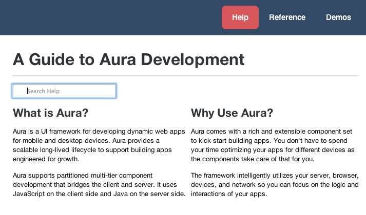
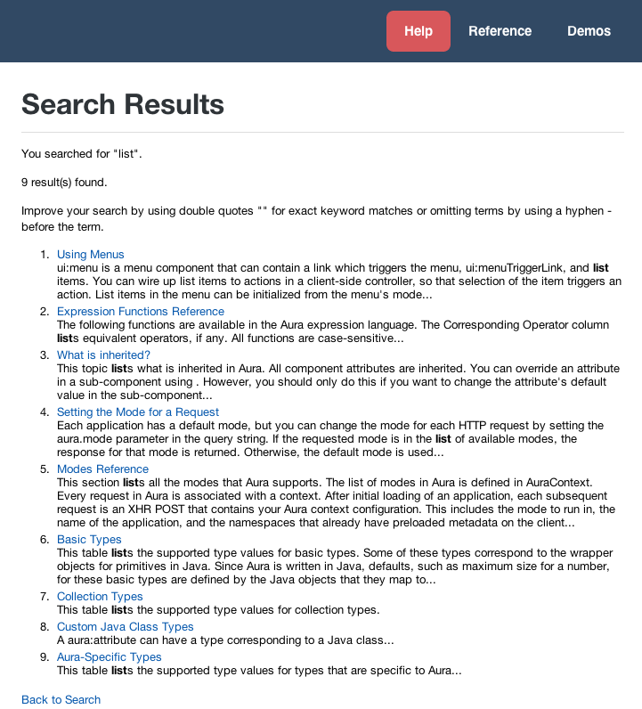

# Search Component for Aura Docs
This search component is developed for the Aura docs app using the Aura Framework (forcedotdom/aura). It uses the [JSE search engine](www.javascriptkit.com) to compare search terms
with content in the index. But instead of using a session cookie, the search term is passed in the location hash. 

## Using the Search Component
Prerequisites: You must already be using the [Aura Framework](https://github.com/forcedotcom/aura).

1. Copy the `search` and `searchResultsTopic` folders into the `auradocs` namespace.
 
2. In `welcomeTopic.cmp`, add `<auradocs:seach />` before the `ui:block` component.

3. Start using the search component by entering a keyword and press enter. 

